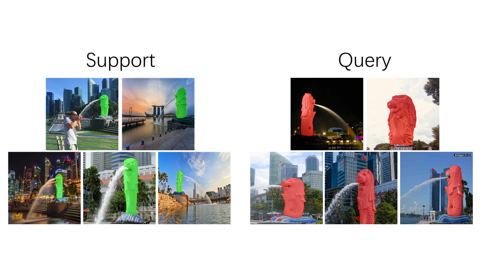

# FSS-1000: A 1000 Class Dataset for Few-shot Segmentation 



We provide our dataset and PyTorch implementation for relation network benchmark. Details are in our paper. 

## Prerequisites
- Linux or macOS
- Python 3
- CPU or NVIDIA GPU + CUDA CuDNN
- PyTorch 0.4+

## FSS-1000 Dataset
- Google drive: [download here](https://drive.google.com/open?id=16TgqOeI_0P41Eh3jWQlxlRXG9KIqtMgI)
- [Online Preview](http://35.236.10.4/dataset)   

## Getting Started
### Testing
First, download pretrained model [here](https://drive.google.com/open?id=1Dq8B-OKQT2ScVLkZGQ4DaCHU_5uDZznZ).

```
python autolabel.py -sd imgs/example/support -td imgs/example/query
```

- Set option ```-sd``` to the support directory and the script will input them as support set. 
- Set option ```-td``` to the path of your query images.
- Results will be saved under ```./results```

View our testing results [here](http://35.236.10.4/scale)    

### Testing your own data
- Label 5 support images following the format in ```imgs/example/support/```.  
- Set your support and query path accordingly.

### Training
```
Coming soon
```
  
